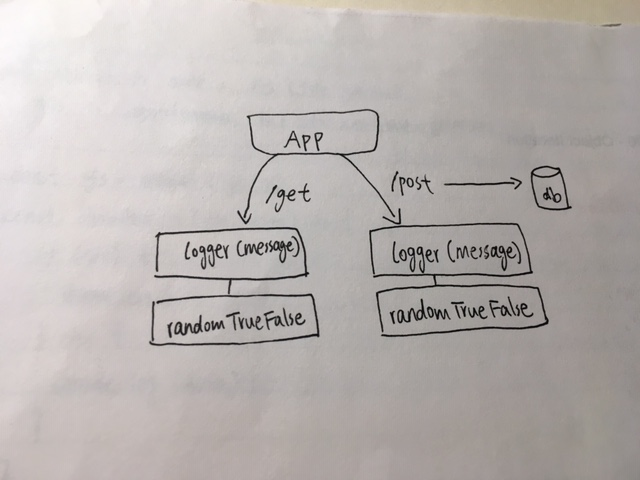

# LAB - 07

## API Server

### Author: David Zheng 

### Links and Resources
* [submission PR](https://github.com/davidzheng-401d32/lab-07-api-server/pull/1)
* [travis](https://travis-ci.com/davidzheng-401d32/lab-07-api-server/builds/133120602)
* [back-end](https://davidzheng-lab-07.herokuapp.com/) (when applicable)
* 

### Setup
#### `.env` requirements
* `PORT` - 3000

#### Running the app
App is not completed yet; the server routes need to be modularized.

#### UML
